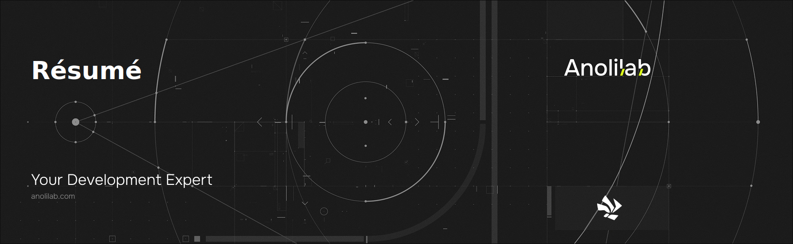

<a href="https://github.com/anolilab/semantic-release" align="center">

  

</a>

<h3 align="center">

This is the theme repository for the [Json Résumé](https://jsonresume.org/) project. Unlike the [json-theme-boilerplate](https://github.com/jsonresume/jsonresume-theme-boilerplate) project, this environment has a much improved developer environment to make editing your theme super to do.

</h3>

<br />

<div align="center">

[![typescript-image][typescript-badge]][typescript-url]
[![mit licence][license-badge]][license]
[![Chat][chat-badge]][chat]
[![PRs Welcome][prs-welcome-badge]][prs-welcome]

</div>

---

<div align="center">
    <p>
        <sup>
            Daniel Bannert's open source work is supported by the community on <a href="https://github.com/sponsors/prisis">GitHub Sponsors</a>
        </sup>
    </p>
</div>

---


## Installation

This project uses [pnpm](https://pnpm.io/), [vitejs](https://vite.dev/) and [vitest](https://vitest.dev/) for all its internal build processes. In theory, this project requires at lest Node v20 to run.

## Quick Commands

- `pnpm run dev` - Run the build and generate an résumé html page for development
- `pnpm run build` - Builds the résumé into a `html` file
- `pnpm run build:pdf` - Builds the résumé into a `pdf` file (requires `pnpm run build` to be called first)
- `pnpm run download:resume` - Download your gist resume.json (and resume.private.jons)
- `pnpm run serve` - Locally preview the production build

## Creating your résumé.json

This project comes with `resume-sample.json`, which is a sample json résumé you can build from. If you don’t create a `resume.json` file, it will automatically be created against the `resume-sample.json` file.

It’s highly **recommended** to create your own `resume.json` for your own résumé. If you create a `resume.json`, this will automatically be used by the app instead. The `resume.private.json` file is automatically ignored from GIT to ensure you cannot check it in (since you’ll have personal information on there). If you do decide that you want to check it in, you can comment the following line in `.gitignore` like so:

```
# Keep your personal resume.json private
# resume.json
# resume.private.json
```

Please review the [schema here](https://jsonresume.org/schema/) when creating your `resume.json`.

## Developing your résumé

- Copy the `.env.dist` to `.env.local`
- To make use of the `GitHub stars` feature, fill the `VITE_GITHUB_AUTH_TOKEN` variable with your `GitHub auth_token`, to not run into GitHub’s API limitation
- To use the `pnpm run download:resume` command, fill the `VITE_GITHUB_RESUME_GIST_ID` variable with your `gist id`
- Start the dev server (`pnpm run dev`)

## Generating an résumé locally

To generate an résumé locally:

- Copy the `.env.dist` to `.env.local`
- To make use of the `GitHub stars` feature, fill the `VITE_GITHUB_AUTH_TOKEN` variable, to not run into GitHub’s API limitation
- Start the dev server (`pnpm run dev`)
- Print the web page (<kbd>⌘</kbd>/<kbd>Ctrl</kbd>+<kbd>P</kbd>) as a PDF In fact, this <!-- textlint-disable write-good -->
  Is exactly how the PDF is generated by the pipeline. Since the pipeline uses <!-- textlint-enable write-good -->
  [headless Chrome](https://chromium.googlesource.com/chromium/src/+/lkgr/headless/README.md#headless-chromium),
  printing the résumé locally using Chrome will provide the most consistent
  result.
- Or you can use the `pnpm run build:pdf"` command, but before you can use this command you need to call `pnpm run build`
- To check the build résumé, call `pnpm run serve`

## Generating an résumé on netlify

- Provide the env variables `VITE_GITHUB_AUTH_TOKEN` to not get the `GitHub` API limit
- Option if you like to download the résumé from a `GitHub` gist, provide the `VITE_GITHUB_RESUME_GIST_ID` with your `gist id`

`netlify.toml`:

```toml
[build]
# If you download your resume.json (and resume.private.json) from a gist please use the command below and uncomment the current command
#  command = "pnpm run download:resume && pnpm run build && pnpm run build:pdf"
command = "pnpm run build && pnpm run build:pdf"
publish = "dist"

[build.environment]
NODE_VERSION = "20"
```

## Why not use the PDF generated by the pipeline

The pipeline generates a PDF using the public information found in
`resume.json` and does not include any private data
specified in `resume.private.json`. (For example, phone numbers.)

## Supported Node.js Versions

Libraries in this ecosystem make the best effort to track
[Node.js’ release schedule](https://nodejs.org/en/about/releases/). Here’s [a
post on why we think this is important](https://medium.com/the-node-js-collection/maintainers-should-consider-following-node-js-release-schedule-ab08ed4de71a).

## Contributing

If you would like to help take a look at the [list of issues](https://github.com/anolilab/resume/issues) and check our [Contributing](.github/CONTRIBUTING.md) guild.

> **Note:** please note that this project is released with a Contributor Code of Conduct. By participating in this project you agree to abide by its terms.

## Credits

- [Daniel Bannert](https://github.com/prisis)
- [All Contributors](https://github.com/anolilab/resume/graphs/contributors)

## Made with ❤️ at Anolilab

This is an open source project and will always remain free to use. If you think it’s cool, please star it 🌟. [Anolilab](https://www.anolilab.com/open-source) is a Development and AI Studio. Contact at [hello@anolilab.com](mailto:hello@anolilab.com) if you need any help with these technologies or want to say hi!

## License

The anolilab résumé is open-sourced software licensed under the [MIT license][license]

<!-- badges -->

[license-badge]: https://img.shields.io/github/license/anolilab/resume?style=for-the-badge
[license]: https://github.com/anolilab/resume/blob/main/LICENSE.md
[prs-welcome-badge]: https://img.shields.io/badge/PRs-welcome-brightgreen.svg?style=for-the-badge
[prs-welcome]: https://github.com/anolilab/resume/blob/main/.github/CONTRIBUTING.md
[chat-badge]: https://img.shields.io/discord/902465130518949899.svg?style=for-the-badge
[chat]: https://discord.com/invite/TtFJY8xkFK
[typescript-badge]: https://img.shields.io/badge/Typescript-294E80.svg?style=for-the-badge&logo=typescript
[typescript-url]: https://www.typescriptlang.org/
